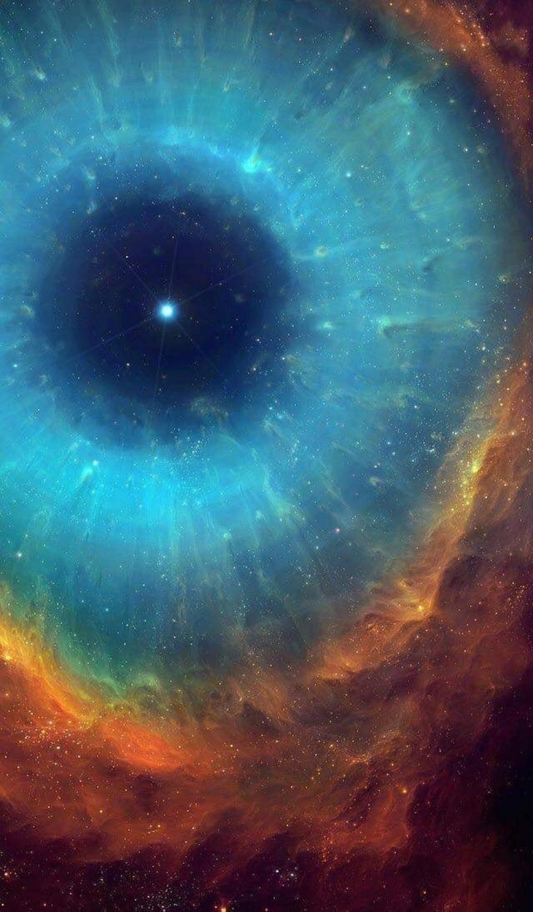

# This is a clone of another project:

[https://github.com/r00tman/corrupter](https://github.com/r00tman/corrupter)
their [readme](old_README.md)

What I have done is built it on Windows and created a python wrapper to make the tool easier to use.

I built this for myself, but if you are interested in glitching various images, well here you go.

Building this is easy, so if you dont care about the python wrapper, go check out the original.

For the wrapper I made it a bit easier to control, and much easier to bulk edit images.

### Example Images

Original

Glitched/Corrupted

Before

Glitched/Corrupted

Before

Corrupted/Glitched

